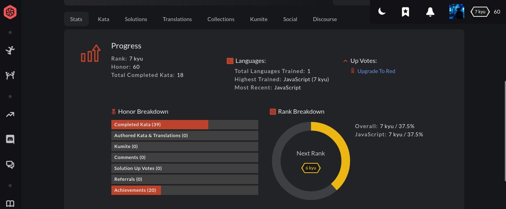
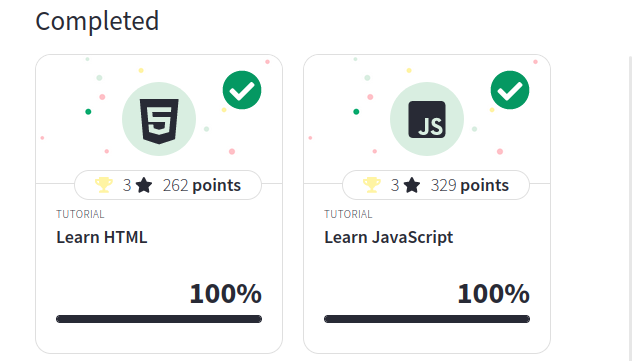

# GURBANOW MAKSIM

## Frontend developer

## Contancts

- **Phone:** +905010696899
- **E-mail:** maksim20051708@gmail.com
- **Telegram:** @maksim_gurbanow

## About me:

I'm motivated individual with a strong desire to obtain my first job as a Frontend Developer. I have a big interest in creating user-friendly web interfaces, sites. My goal is to make a meaningful contribution in the world. I'm excited to bring my skills and creativity and obtain neccessary knowledge from team of experienced developers. Please, contact me, if I interested you.

## My Skills:

1. JavaScript, TypeScript
2. HTML, CSS
3. React
4. NodeJS, PHP
5. Git, GitHub
6. Figma

<details>
<summary style="font-size:20px">Achievements:</summary>
<h3 align="center"><a href="https://www.codewars.com/users/maksim72948/stats">CodeWars</a></h3>


</details>

<details>
<summary style="font-size:20px"><a href="https://github.com/MaksimGurbanow">My GitHub:</a></summary>

<h3>1. <a href="https://maksimgurbanow.github.io/tetris/">Tetris</a></h3>
Classical arcade game written in JavaScript. Click on title to play
</details>

<details>
<summary style="font-size:20px">Courses:</summary>

</details>

<details>
<summary style="font-size:20px">Languages:</summary>

1. Russian - native
2. English - upper-intermediate
3. French - intermediate
4. Turkish - elementary
</details>

<details>
  <summary style="font-size:20px">Code examples:</summary>
  
  <br>

  <p align="center">Binary Search</p>
  
  ```JavaScript
  Array.prototype.binarySearch = function(item) {
    let low = 0;
    let high = this.length -1;
    while(low <= high) {
      const mid = Math.floor(low + high);
      const guess = this[mid];
      if(guess === item) {
        return mid;   
      }
      else if(guess < item) {
        low = mid + 1;
      }
      else {
        high = mid - 1;
      }
    }
    return -1;
  }
  ```

  <br>

  <p align="center">QuickSort</p>

```JavaScript
Array.prototype.quickSort = function () {
  if (this.length < 2) {
      return this;
  } else {
      let strongPoint = this[0];
      let less = [];
      let more = [];

      for (const element of this) {
          if (element > strongPoint) {
                more.push(element);
            } else if (element < strongPoint) {
                less.push(element);
            }
        }
      return [...less.quickSort(), strongPoint, ...more.quickSort()];
    }
};
```

</details>
